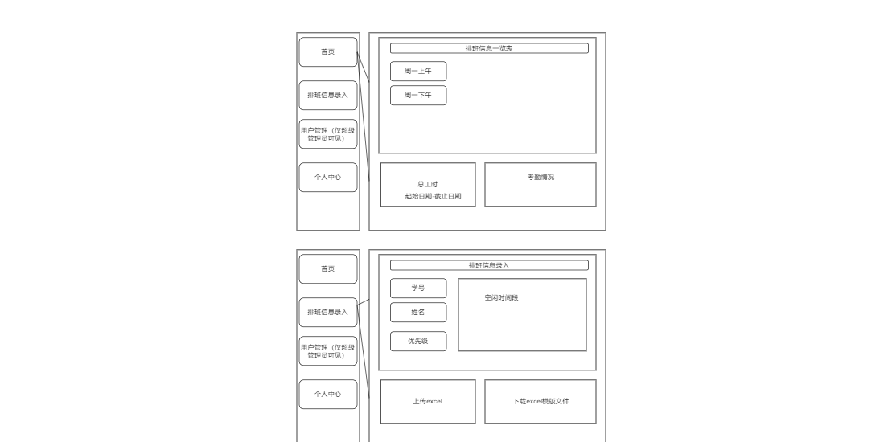

**产品原型设计**
1. # **排班系统**
## **1.1 需求**
### **员工信息输入：**
- 用户可以通过表单输入员工的姓名、工号、经济情况和空闲时段（周一上午、周一下午、周二上午...）。
- 点击"添加员工"按钮将员工信息存储到系统中。
### **生成排班表：**
- 点击"生成排班表"按钮，系统会根据员工的空闲时段和经济情况生成排班表。
- 排班表会显示在页面下方，每个时段对应一名值班员工。
### **算法逻辑：**
- 按经济困难程度优先分配时段（特别困难>一般困难>无困难）。
- 算法参考：基于优先级的贪心算法
- 确保每个员工至少分配到一个时段。
- 如果某时段没有员工空闲，该时段显示为"无人值班"。
- 周期性排班生成（13周循环）
- 自动冲突检测
- 经济困难员工优先
- 可视化值班表展示
## **1.2 UI界面**
- 主页
- 排班信息录入
- 可以由上传excel的形式录入
- 以手动单个录入：学号、姓名、空闲时间段（下拉框多选：每个半天一个下拉框，如周一上午一直到周日晚上）
- 用户管理
- 级管理员可见该按钮
- 超理员可以删除、增加用户
- 工时
- 个人中心
- 普通用到个人信息（如排班时间、工时计算（每个半天是一次工时）等）
- 换班
## **1.3 排班系统原型图**

1. # **学工常用功能**

## **2.1 需求**
### **2.1.1 教学科研辅助**
**教学辅助**：与聂彦老师团队紧密合作，将知识图谱（Neo4j）等技术与 DeepSeek 问答系统进行深度整合，通过优化数据接口和算法，深入探索该系统在教学科研知识支持方面的有效方法。

**科研辅助**：通过部署 AI 优化工具链，探索在科研领域的应用，例如以 Circuit Training RL 框架的本地部署实践应用为例，对工具链展开全方位测试与优化，探究其在科研场景中的应用有效性。
### **2.1.2 思政教育研究**
1. **学生日常事务管理**
- 提供7×24小时高频事务智能应答服务，涵盖请假审批流程、大学生医保政策、资助申请指南、生产实习学分认证等；
  - 学院常见文件：出国学分确认办法、生产实习确认办法、保研手册、考研手册等
- 支持常见事务文件自动化处理
  - 朋辈辅导课时统计与课酬计算生成
  - 自动排班系统与工时计算结算
1. **学业支持模块**
- 学业分析系统
  - 权限划分：老师、学生
- 构建多源数据融合分析体系，通过对学生融合数据分析定位学业薄弱环节，输出个性化学习方案；
- 针对高挂科率课程，开发基于知识图谱技术推荐分层学习资源与专项训练题库。
1. **职业发展支持模块**
- 提供简历智能修改与评分服务，实现学生能力画像与用人单位岗位需求的智能匹配；
- 打造专业适配的AI面试官系统，运用语音情感分析与语义理解技术模拟真实面试场景，提供回答策略优化建议。
1. **心理风险识别**
- 构建动态心理预警模型（整合学业成绩、日常消费、心理谈话记录等多维度数据），
- 根据基本情况描述预测心理风险等级，为精准心理干预提供决策支持；
- 配套开发心理健康数字档案模块，实现风险评估报告自动生成。

