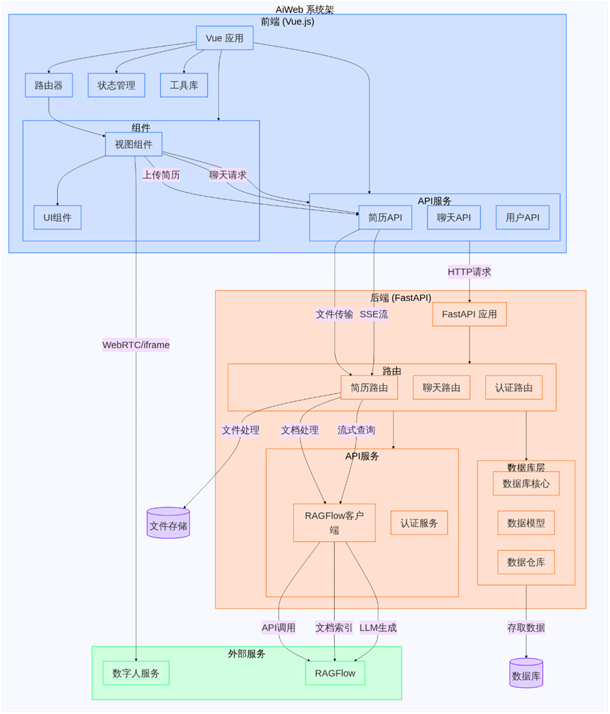

# 开发手册
本文档将系统阐述整个项目架构与开发目标，以帮助开发者充分了解项目。

## 项目整体架构
项目整体采用前后端分离、微服务的架构，目前的整体架构如下图所示：（AI绘制）



### 技术栈：
- 前端：vite（前端构建）+vue3（用户界面代码框架）+typescript+Element-Plus（前端UI组件库）
- 后端：python+fastapi+mysql（存储用户、token、身份验证数据）+ragflow（构建agent以及专属知识库、知识图谱、工作流、管理会话）

### 部署概览：
整体项目位于`/home/jhyang/AiWeb`，项目文件树：
``` shell
AiWeb/
├── LiveTalking     # Github开源数字人项目（已分支）
├── ragflow         # RagFlow项目
├── webAi_backEnd   # 后端项目
└── webAi_frontEnd  # 前端项目
```
项目各个服务的端口占用情况：
- LiveTalking：服务运行于端口`8010`
- RagFlow：服务运行于docker容器`ragflow-server`，映射于宿主机的`8080`端口下
- webAi_backEnd：服务运行于端口`8888`
    - mysql：服务运行于docker容器`webai_backend_mysql`，映射于宿主机端口`3306`
- webAi_frontEnd：服务运行于端口`5180`，由nginx反向代理

nginx代理配置：
``` nginx
server {
    # 监听前端地址
    listen 5180;
    server_name 222.20.98.159;
    
    location / {
	root /home/jhyang/AiWeb/webAi_frontEnd/dist;
	index index.html;
	try_files $uri $uri/ /index.html;
    }
    
    # 反向代理后端API（所有以/api开头的请求转发到后端）
    location /api {
        proxy_pass http://localhost:8888;  # 后端服务地址
        proxy_set_header Host $host;
        proxy_set_header X-Real-IP $remote_addr;
        proxy_set_header X-Forwarded-For $proxy_add_x_forwarded_for;
        proxy_set_header X-Forwarded-Proto $scheme;

	# 可选：调整超时时间
        proxy_connect_timeout 60s;
    	proxy_read_timeout 600s;
        proxy_send_timeout 600s;
    }
    
    # 数字人API代理
    location /digitalperson/ {
        proxy_pass http://localhost:8010/;
        
        # WebRTC必要配置
        proxy_http_version 1.1;
        proxy_set_header Upgrade $http_upgrade;
        proxy_set_header Connection "upgrade";
        proxy_set_header Host $host;

        # 额外的WebRTC相关配置
        proxy_set_header X-Real-IP $remote_addr;
        proxy_set_header X-Forwarded-For $proxy_add_x_forwarded_for;
        proxy_set_header X-Forwarded-Proto $scheme;

        # 确保所有HTTP方法可用
        proxy_method $request_method;

        # 增加超时时间
        proxy_connect_timeout 7d;
        proxy_send_timeout 7d;
        proxy_read_timeout 7d;
    }
    
    # WebSocket代理
    location /ws {
        proxy_pass http://localhost:8888;  # 必须指向WebSocket后端地址
        proxy_http_version 1.1;
        proxy_set_header Upgrade $http_upgrade;
        proxy_set_header Connection "upgrade";
        proxy_set_header Host $host;
        proxy_read_timeout 3600s;
        proxy_send_timeout 3600s;
    }
}
```

同时Fork并部署了github开源项目`LiveTalking`，专门用于数字人视频、音频的推流服务。

## 前端架构设计
前端服务项目结构：
``` shell
.
├── api     # 与后端服务的api接口
│   ├── index.ts        # 批量导出API，以供任何其他组件更方便的调用
│   ├── interviewApi.ts # AI面试API
│   ├── resumeApi.ts    # 简历API
│   └── userApi.ts      # 用户身份验证API
├── App.vue # 挂载应用，主界面
├── assets  # 公共资源（如css样式、图片等资源）
├── components  # 组件模块（可以模块化地插入到页面中）
│   ├── FloatingAvatar.vue  # 浮动图像组件
│   ├── FloatingModel.vue   # 浮动3D模型组件
│   ├── icons   #封装成组件的图片资源
│   │   ├── IconCommunity.vue
│   │   ├── IconDocumentation.vue
│   │   ├── IconEcosystem.vue
│   │   ├── IconLogo.vue
│   │   ├── IconSupport.vue
│   │   └── IconTooling.vue
│   └── index.ts
├── layout  # 布局组件
│   ├── Header.vue  # 头栏，负责记录用户路由
│   └── SideBar.vue # 边栏，负责一级功能模块
├── main.ts # 网页应用入口文件，负责加载网页应用APP、加载插件以及初始化配置
├── router  # 网页路由，负责建立url路径与之对应要渲染的组件的映射
│   └── index.ts
├── store   # 状态管理仓库，负责管理全局变量
│   ├── index.ts
│   └── user.ts     # 管理用户信息（包括token、验证信息）
├── utils   # 实用typescript封装工具类
│   └── chatHistory.ts  # 聊天会话管理类，集成实现会话管理
└── views   # 与特定路由绑定视图组件，目录关系体现路由关系
    ├── analysis    # 学业分析界面
    │   ├── index.vue
    │   ├── interview   # 面试子界面
    │   │   └── index.vue
    │   └── resume      # 简历子界面
    │       └── index.vue
    ├── education   # 教学科研界面
    │   └── index.vue
    ├── error       # 错误页面
    │   └── index.vue
    ├── Home        # 首页
    │   └── index.vue
    ├── Login       # 登录页面
    │   └── index.vue
    └── student     # 学生事务页面
        └── index.vue
```

使用`pinia`插件完成进行全局状态管理

## 后端架构设计
